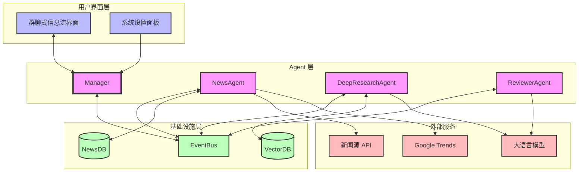
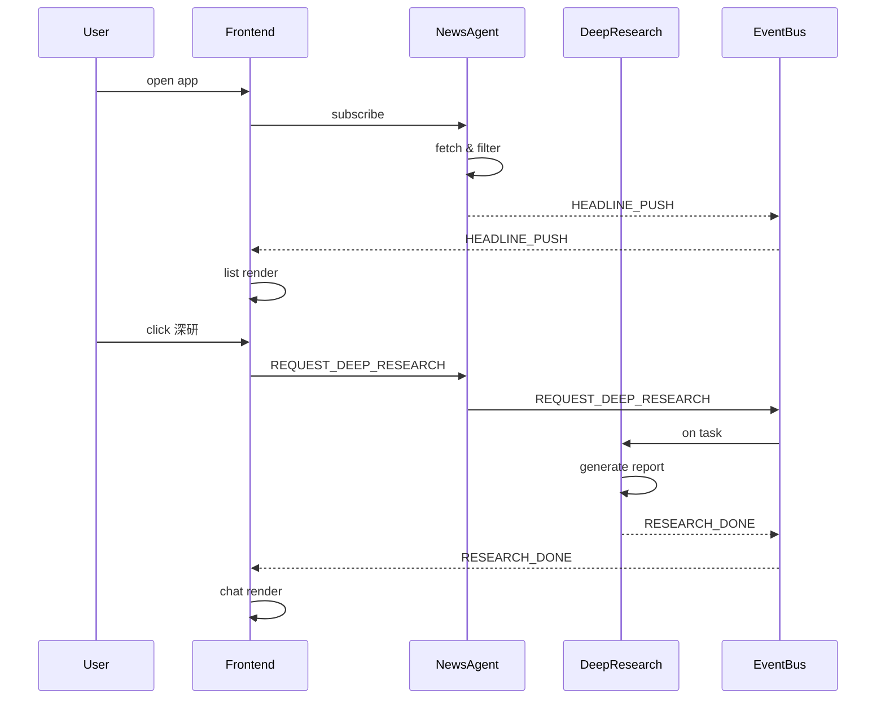
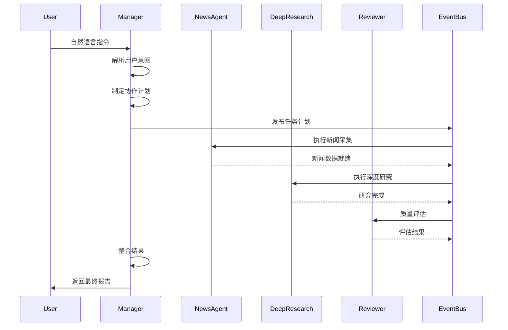

# A2A News ⇄ Deep Research Demo

> **一句话简介**：本 Demo 旨在验证如何通过 **A2A（Agent‑to‑Agent）协议** 构建一个"新闻流推送 → 按需深研" 的互操作工作流，并在第二阶段展示更高水平的大模型自治与多 Agent 协作能力。

---

### Phased Roadmap

| 阶段                       | 主要目标    | 关键特性                                                                                                                                                                                      | Agent 自主性                                            |
| ------------------------ | ------- | ----------------------------------------------------------------------------------------------------------------------------------------------------------------------------------------- | ---------------------------------------------------- |
| **Phase‑1  (MVP)**       | *可插拔验证* | ‑ NewsAgent 依据企业画像定时拉取 DB 最新新闻 → 推送 **headline list**<br>‑ 用户对感兴趣 headline 手动点击 "深度研究" → 触发 A2A RESEARCH task                                                                             | 主要由用户驱动；Agent 仅筛选并推送 headlines                       |
| **Phase‑2  (Autonomy+)** | *智能协同*  | ‑ 引入 Manager 作为核心协调者，负责理解用户意图并编排工作流<br>‑ 保持 NewsAgent 作为独立黑盒，专注于新闻采集和过滤<br>‑ 构建灵活的 Agent 协作框架，支持快速接入新的黑盒 Agent<br>‑ 通过 A2A 协议实现标准化的 Agent 间通信 | 中‑高；Manager 负责协调，各 Agent 通过 A2A 协议协作，用户通过自然语言交互 |

> **后续扩展**：Phase‑3 可加入"行动 Agent" 自动撰写邮件 /报告草稿，或对接外部任务管理系统。

---


# A2A News ⇄ Deep Research Demo

> **一句话简介**：本 Demo 用于验证如何借助 **A2A（Agent‑to‑Agent）协议** 把"新闻流推送 → 按需深研" 的两类智能体解耦并灵活协作。项目分 **Phase‑1（MVP）** 与 **Phase‑2（Autonomy+）** 两阶段逐步演进。

---

## 0. 整体蓝图



### 关键流程

1. **新闻推送流程**
   - NewsAgent 从新闻源获取数据
   - 基于企业画像进行过滤
   - 通过 EventBus 推送至界面

2. **深度研究流程**
   - Manager 接收用户指令并解析意图
   - 制定 Agent 协作计划
   - 协调各 Agent 执行任务
   - 整合结果并返回用户

3. **反馈优化流程**
   - 收集用户反馈
   - Manager 更新协作策略
   - 优化 Agent 组合
   - 调整执行计划

---

## 1. 阶段里程碑概览

| 阶段                      | 主要目标            | 关键特性                                                                                                                                                                       | Agent 自主性                           |
| ----------------------- | --------------- | -------------------------------------------------------------------------------------------------------------------------------------------------------------------------- | ----------------------------------- |
| **Phase‑1 (MVP)**       | *协议验证 & 最小可用产品* | ‑ NewsAgent 依据企业画像定时拉取最新新闻<br>‑ 过滤后推送 **headline list** 至信息流<br>‑ 用户对感兴趣 headline 点击 "深度研究" → 触发 A2A `REQUEST_DEEP_RESEARCH`                                               | 低；Agent 仅做检索 + 过滤 + 推送，深研由用户显式触发    |
| **Phase‑2 (Autonomy+)** | *智能协同 & 自主决策*   | ‑ NewsAgent 引入语义打分/聚类，对 headline 进行"研究价值"评估<br>‑ 当评分 ≥ 阈值时 **自动** 发送深研请求，并在群聊说明理由<br>‑ DeepResearchAgent 可链式协作额外黑盒 Agent（风险扫描、竞争扫描等）<br>‑ （可选）ReviewerAgent 评价研究质量并建议下一步行动 | 中‑高；Agent 可主动协商、拆解子任务，用户主要充当审核与反馈角色 |

---

## 2. Phase‑1 产品功能详细说明

### 2.1 功能目标

* 在最小成本下打通 **信息流推送 → 用户点选 → 深度研究** 的闭环。
* 验证 A2A 协议在三方（NewsAgent、DeepResearchAgent、前端 UI）之间的 **消息路由、状态回传、结果整合**。
* 为 Phase‑2 的自治拓展留下接口与配置位。

### 2.2 关键用户故事

| 编号   | 用户故事                                        | 验证点                                                           |
| ---- | ------------------------------------------- | ------------------------------------------------------------- |
| US‑1 | 作为用户，我希望系统持续推送与我企业画像相关的**新闻标题列表**，以便快速了解动态。 | NewsAgent 的定时抓取、过滤、推送逻辑正常运行；信息流 UI 能即时渲染新卡片。                  |
| US‑2 | 作为用户，当某条标题引起兴趣，我可以一键请求深度研究，并在群聊中查看进度与最终报告。  | "深度研究"按钮正确触发 A2A 事件；DeepResearchAgent 能返回结构化报告并展示于聊天气泡中。      |
| US‑3 | 作为用户，我希望能在任意时刻切换 Topic 过滤器或暂停推送。            | 配置页调用 NewsAgent 的 `update_topic_filter()` API；Agent 响应并持久化变更。 |

### 2.3 功能清单

| 模块                    | 功能点                          | 说明                                                                                                   |
| --------------------- | ---------------------------- | ---------------------------------------------------------------------------------------------------- |
| **NewsAgent**         | `fetch_news()`               | 按 `cron` 计划或用户手动 `REFRESH`，从 `NewsDB` / RSS / NewsAPI 拉取 24h 内新闻；默认 10 分钟一次，可配置。                     |
|                       | `filter(&topic_filter)`      | 依据企业画像关键字（行业、地域、供应链）+ 基础规则（去重、白名单域名）过滤；输出 ≤30 条 / 轮。                                                 |
|                       | `publish_headlines()`        | 将 `{headline, topic_id, source_url}` 列表经 EventBus 发布 `HEADLINE_PUSH` 并缓存至数据库。                        |
| **Frontend**          | 信息流列表                        | 竖向卡片；点击展开摘要、原文链接、⚡️"深度研究" 按钮。                                                                        |
|                       | 群聊窗口                         | 三种气泡：用户、NewsAgent、DeepResearchAgent；系统状态（⏳ 正在研究…）以 system 消息展示。                                      |
| **DeepResearchAgent** | `on_REQUEST_DEEP_RESEARCH()` | 监听 EventBus；收到任务后执行：<br>1) 多跳检索<br>2) 关键信息抽取 / RAG<br>3) 报告生成（markdown+引用）<br>4) 发布 `RESEARCH_DONE`。 |

### 2.4 交互时序（典型）




---

## 3. Phase‑2 产品功能详细说明

### 3.1 功能目标

* 引入 Manager 作为核心协调者，负责理解用户需求并编排 Agent 协作
* 保持 NewsAgent 作为独立黑盒，专注于新闻采集和过滤
* 构建灵活的 Agent 协作框架，支持快速接入新的黑盒 Agent
* 通过 A2A 协议实现标准化的 Agent 间通信

### 3.2 增量功能清单

| 模块                     | 新增/变化                    | 说明                                                                                                                        |
| ---------------------- | ------------------------ | ------------------------------------------------------------------------------------------------------------------------- |
| **Manager**            | `parse_user_intent()`    | 解析用户自然语言指令，理解用户意图和需求                                                                                                    |
|                        | `plan_agent_workflow()`  | 根据用户意图制定 Agent 协作计划，确定执行顺序和依赖关系                                                                                        |
|                        | `monitor_progress()`     | 监控各 Agent 执行状态，处理异常情况                                                                                                    |
|                        | `aggregate_results()`    | 整合各 Agent 输出，生成最终报告                                                                                                      |
| **NewsAgent**          | 保持不变                    | 继续负责新闻采集、过滤和推送                                                                                                        |
| **DeepResearchAgent**  | 作为黑盒接入                | 通过 A2A 协议接入，保持原有功能                                                                                                      |
| **ReviewerAgent**      | 作为黑盒接入                | 通过 A2A 协议接入，负责质量评估                                                                                                      |
| **Frontend**           | 指令输入界面                | 支持自然语言指令输入                                                                                                            |
|                        | 工作流可视化                | 展示当前执行的工作流状态                                                                                                          |
|                        | 结果展示优化                | 支持多维度结果展示和交互                                                                                                          |

### 3.3 高级时序 – 用户指令驱动的工作流



### 3.4 Agent 协作框架

1. **标准化接口**
   - 所有 Agent 通过 A2A 协议通信
   - 统一的输入输出格式
   - 标准化的状态报告机制

2. **灵活接入机制**
   - 新 Agent 只需实现 A2A 协议接口
   - 无需修改现有 Agent 代码
   - 支持动态注册和发现

3. **工作流编排**
   - 支持并行和串行执行
   - 动态调整执行顺序
   - 异常处理和重试机制

4. **用户交互优化**
   - 自然语言指令解析
   - 工作流状态可视化
   - 实时进度反馈

### 3.5 扩展性设计

1. **新 Agent 接入流程**
   - 实现 A2A 协议接口
   - 注册到 Manager
   - 定义能力描述
   - 配置协作规则

2. **能力发现机制**
   - Agent 能力自动注册
   - 动态能力匹配
   - 版本管理

3. **协作模式扩展**
   - 支持多种协作模式
   - 可配置的协作规则
   - 灵活的扩展点

---

## 1. Agent 角色与职责

| 角色                       | 描述                                                                                                                                                                       | 关键接口（A2A event）                                                                |
| ------------------------ | ------------------------------------------------------------------------------------------------------------------------------------------------------------------------ | ------------------------------------------------------------------------------ |
| 🎯 **Manager**           | ‑ 作为系统核心协调者，负责理解用户意图并编排工作流<br>‑ 维护 Agent 能力注册表，动态匹配任务需求<br>‑ 监控执行状态，处理异常情况<br>‑ 整合各 Agent 输出，生成最终报告<br>‑ 提供用户交互界面，支持自然语言指令输入 | `REGISTER_CAPABILITY()`<br>`TASK_PLAN()`<br>`WORKFLOW_STATUS()`<br>`AGGREGATE_RESULTS()` |
| 📰 **NewsAgent**         | ‑ 作为独立黑盒，专注于新闻采集和过滤<br>‑ 按企业画像定时拉取最新文章<br>‑ 执行基础过滤和去重<br>‑ 通过 A2A 协议推送新闻数据                                                                 | `FETCH_NEWS()`<br>`PUSH_HEADLINES()`<br>`UPDATE_FILTER()`                     |
| 🔍 **DeepResearchAgent** | ‑ 作为黑盒接入，专注于深度研究任务<br>‑ 接收研究请求，执行多维度分析<br>‑ 生成结构化研究报告<br>‑ 支持多源数据整合和推理                                                                     | `RESEARCH_REQUEST()`<br>`RESEARCH_DONE()`<br>`ADDITIONAL_INFO()`              |
| 📋 **ReviewerAgent**     | ‑ 作为黑盒接入，负责质量评估<br>‑ 评估研究报告的清晰度、证据充分性和偏见程度<br>‑ 提供改进建议<br>‑ 支持多维度评分                                                                         | `EVALUATE_REPORT()`<br>`REVIEW_FEEDBACK()`<br>`QUALITY_SCORE()`               |
| 👤 **User**              | ‑ 通过自然语言与系统交互<br>‑ 查看执行状态和结果<br>‑ 提供反馈和调整建议<br>‑ 配置系统参数                                                                                     | ‑                                                                              |

### 1.1 Agent 协作模式

1. **Manager 主导的协作**
   - 接收用户指令并解析意图
   - 根据意图选择合适的 Agent 组合
   - 制定执行计划并监控进度
   - 处理异常情况和重试逻辑

2. **黑盒 Agent 接入规范**
   - 实现标准 A2A 协议接口
   - 提供能力描述和版本信息
   - 支持状态报告和错误处理
   - 遵循统一的输入输出格式

3. **事件驱动通信**
   - 基于 A2A 协议的事件发布/订阅
   - 异步消息处理
   - 状态同步和进度更新
   - 错误传播和处理

### 1.2 扩展性设计

1. **新 Agent 接入流程**
   ```
   ┌─────────────┐     ┌─────────────┐     ┌─────────────┐
   │ 实现A2A接口  │────▶│ 注册到Manager│────▶│ 定义能力描述 │
   └─────────────┘     └─────────────┘     └─────────────┘
          │                    │                    │
          ▼                    ▼                    ▼
   ┌─────────────┐     ┌─────────────┐     ┌─────────────┐
   │ 配置协作规则 │────▶│ 测试集成    │────▶│ 正式接入    │
   └─────────────┘     └─────────────┘     └─────────────┘
   ```

2. **能力发现机制**
   - 自动注册和发现
   - 版本兼容性检查
   - 动态能力匹配
   - 负载均衡考虑

3. **协作模式扩展**
   - 支持并行执行
   - 支持串行执行
   - 支持条件分支
   - 支持循环和重试

---

## 2. 消息规范（A2A schema）

A2A资料参考：https://github.com/google-a2a/A2A


## 3. 深度研究Agent

外部API
-Exa Deep Research API: https://exa.ai/
-Perplexity Deepresearch: https://docs.perplexity.ai/models/models/sonar-deep-research

开源项目
-Hugging Face Deep Research: https://huggingface.co/blog/open-deep-research
-Langchain Open Deep Research: https://github.com/langchain-ai/open_deep_research


## 4. 前端原型要点

1. **群聊模式**：气泡颜色区分三方，系统消息用于事件播报（🕘 定时推送 / ✅ 深研完成）。
2. **信息流**：主列展示 headline list，点击卡片在侧栏展开详情＋"深度研究"按钮。
3. **阶段切换**：在设置里可勾选 "Autonomy+"，前端提示用户 NewsAgent 可能主动发起深研。
